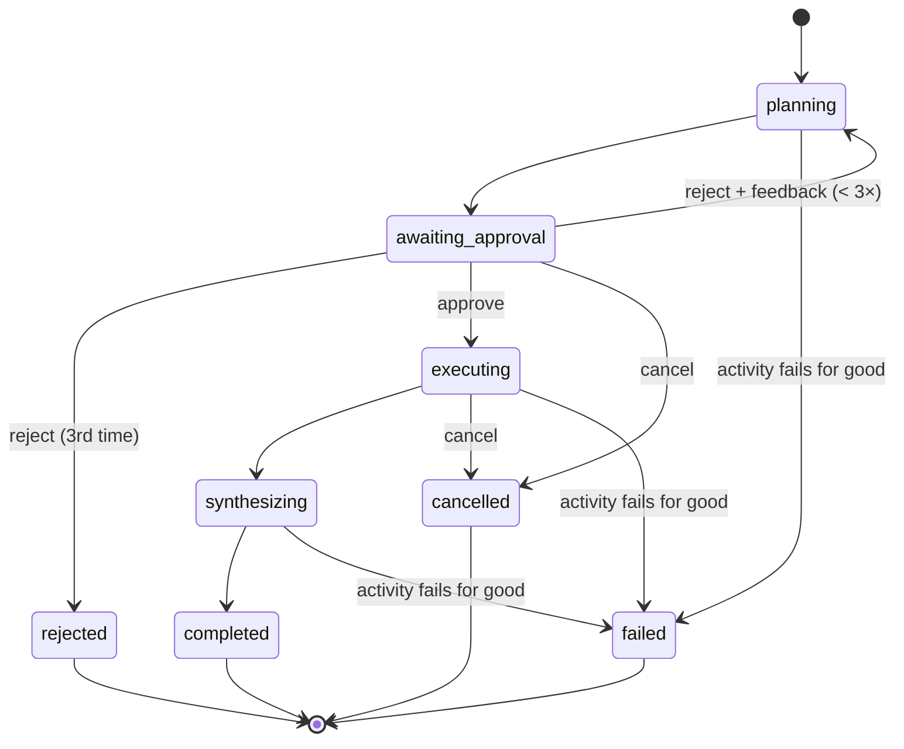
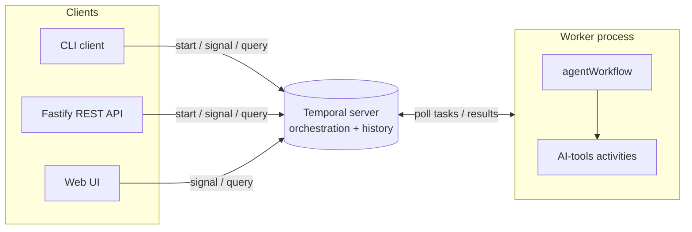

# temporal-claude

A small **human-in-the-loop AI agent** built on [Temporal](https://temporal.io) (TypeScript).
A workflow plans a task, **waits for a human to approve the plan**, executes the approved
steps, and synthesizes a result. The "AI" is **mocked** by default (deterministic, offline, no
API keys) and can be switched to **real Claude** with one setting (see
[Running with real Claude](#running-with-real-claude)) — the point is durable,
human-in-the-loop orchestration, not real inference.



## Architecture

Flat, Temporal-idiomatic layout — the workflow depends only on the `AiToolsActivities` port,
never on an adapter:

```
src/
├── workflow/       # agentWorkflow + AgentRun + contracts (signals/queries) + ports.ts + types.ts
├── activities/      # AiToolsActivities strategies (mock + Claude-backed) + the selector
├── infra/           # config, logger (pino), temporal connection, process-error handlers
├── worker.ts         # entrypoint: hosts the workflow + activities
├── http/             # Fastify REST API (a Temporal client)
└── cli/               # start-only CLI client
```

Key idea: **the workflow runs inside the worker**, not a container of its own. The `temporal`
server is the cluster (orchestration + durable history + Web UI). The CLI, the REST API, and
the Web UI are all just _clients_ that start/signal/query workflows. The workflow depends on
the `AiToolsActivities` **port** (`workflow/ports.ts`); concrete implementations live in
`activities/`, selected by `activities/index.ts` from `AI_PROVIDER` — the offline mock
(default) or Claude — and the workflow never knows which one it got.



## Prerequisites

- **Node 26** (see `.nvmrc`: `nvm use`)
- Either **Docker** (for the compose stack) or the **Temporal CLI**
  (`brew install temporal`) for bare-metal runs

```bash
npm install
```

> **New here?** [`docs/PLAYBOOK.md`](docs/PLAYBOOK.md) has copy-paste steps to run, play
> through every scenario (approve / reject / cancel / guidance), and run the tests.

## Run it — Docker (one command)

```bash
docker compose up --build            # temporal (server + Web UI) + worker + api
docker compose run --rm --build client   # start one workflow, print its id, then exit
```

> **Always use `--build`.** The app is baked into the image, and compose reuses an existing
> image without checking that your code changed. After pulling or editing code, a plain
> `docker compose up` silently runs the **old** code — for example a worker that ignores
> `AI_PROVIDER=claude` and quietly uses the mock.

- Web UI: <http://localhost:8233> · REST API: <http://localhost:3000>
- `worker`, `api` and `client` are one image with different commands; `client` is one-shot
  (`profiles: [tools]`). Compose reads `.env`/`.env.local` and points `TEMPORAL_ADDRESS` at
  the `temporal` service.
- **Real Claude in Docker:** set `AI_PROVIDER=claude` and `ANTHROPIC_API_KEY` in `.env.local`,
  then `docker compose up --build`. The values reach the containers at runtime through
  `env_file`; `.dockerignore` keeps `.env`/`.env.local` out of the image, so the key is never
  baked in. Values in `.env.local` win over variables exported in your shell.

## Run it — bare metal

Three terminals:

```bash
temporal server start-dev            # 1. cluster + Web UI (:7233 / :8233)
npm run worker                       # 2. worker — hosts the workflow + activities
npm run api                          # 3. Fastify REST API on :3000
# or start a workflow directly:
npm run start -- "your topic here"   #    CLI client (start-only)
```

## Human-in-the-loop: approving a plan

After a workflow starts it **blocks awaiting approval**. Approve it three ways:

**REST API**

```bash
# start
curl -sX POST localhost:3000/agents -H 'content-type: application/json' \
     -d '{"topic":"temporal vs cron"}'          # → 201 { "data": { "workflowId": "agent-…" } }
# inspect the plan
curl -s localhost:3000/agents/<id>               # → 200 { "data": <AgentState> }
# approve (or reject with feedback)
curl -sX POST localhost:3000/agents/<id>/approve -H 'content-type: application/json' \
     -d '{"approved":true}'                       # → 202
# other signals
curl -sX POST localhost:3000/agents/<id>/guidance -H 'content-type: application/json' \
     -d '{"guidance":"prefer recent sources"}'    # → 202
curl -sX POST localhost:3000/agents/<id>/cancel   # → 202
```

Endpoints (success `{ "data": … }`, error `{ "error": { "code", "message" } }`):

| Method & path               | Body                                       | Response               |
| --------------------------- | ------------------------------------------ | ---------------------- |
| `POST /agents`              | `{ topic: string }`                        | `201 { workflowId }`   |
| `GET /agents/:id`           | —                                          | `200 AgentState`       |
| `POST /agents/:id/approve`  | `{ approved: boolean, feedback?: string }` | `202`                  |
| `POST /agents/:id/guidance` | `{ guidance: string }`                     | `202`                  |
| `POST /agents/:id/cancel`   | —                                          | `202`                  |
| `GET /healthz`              | —                                          | `200 { status: "ok" }` |

Invalid body → `400 VALIDATION_ERROR`; unknown workflow id → `404 NOT_FOUND`. Signals are
fire-and-forget, hence `202`.

**Temporal CLI**

```bash
temporal workflow query  -w <id> --type getState
temporal workflow signal -w <id> --name approvePlan --input '{"approved":true}'
```

**Web UI** — open <http://localhost:8233>, find the workflow, inspect its history, and send
the `approvePlan` signal / `getState` query.

## Running with real Claude

By default the agent uses the offline mock. To use Claude instead:

1. In the Anthropic Console, create an API key **inside a workspace**. An organization-scoped
   key is rejected with `400 … not scoped to a workspace`.
2. Put it in `.env.local` (git-ignored — never commit it):

   ```bash
   AI_PROVIDER=claude
   ANTHROPIC_API_KEY=sk-ant-...
   # ANTHROPIC_MODEL=claude-sonnet-5   # optional override
   ```

3. Check the connection and see typical latency: `npm run claude:check`.
4. Start the worker as usual (`npm run worker`). It logs `AI provider selected` with the provider
   and model only — never the key. Everything else (API, CLI, approval flow) is unchanged.

Good to know:

- **Cost:** a 3-step run makes about 6 Claude calls (plan, one per step, synthesize) — a few cents
  on Sonnet 5. `npm test` never calls the API.
- **Speed** (Sonnet 5): plan ≈ 5 s, each step ≈ 8 s, synthesis ≈ 8 s, so a run takes roughly
  30–60 s after approval. `LOG_LEVEL=debug` shows per-call `durationMs` and token counts.
- **Failures:** rate limits, 5xx and timeouts are retried (3 attempts, 1-minute limit each). A
  refusal, a bad key or a truncated/empty answer is permanent. Either way, when an activity
  finally fails the run ends **`failed`**: `GET /agents/:id` shows `status: "failed"` and a short
  `error` (your own adapters' safe message, or a generic "Activity … failed (…)" — never the raw
  upstream text), and Temporal shows the workflow as Failed with the details in its history.
  Rejecting a plan with feedback sends that feedback to Claude, which re-plans accordingly.

## Configuration

All config flows through `src/infra/config` (the only reader of `process.env`), zod-validated
into a frozen `AppConfig`. Precedence: real env → `.env.local` → `.env` → built-in defaults —
so it **runs with no env files at all**. Copy `.env.example` to `.env` to customize.

| Variable                  | Default            | Purpose                                                                  |
| ------------------------- | ------------------ | ------------------------------------------------------------------------ |
| `TEMPORAL_ADDRESS`        | `localhost:7233`   | Temporal gRPC endpoint                                                   |
| `TEMPORAL_NAMESPACE`      | `default`          | namespace                                                                |
| `TEMPORAL_TASK_QUEUE`     | `ai-agent`         | task queue the worker polls / clients target                             |
| `TEMPORAL_API_KEY`        | —                  | set in `.env.local` for Temporal Cloud (enables TLS)                     |
| `HTTP_PORT` / `HTTP_HOST` | `3000` / `0.0.0.0` | REST API bind                                                            |
| `CORS_ORIGIN`             | `*`                | allowed CORS origin                                                      |
| `LOG_LEVEL`               | `info`             | pino level                                                               |
| `NODE_ENV`                | `development`      | `production` → JSON logs                                                 |
| `AI_PROVIDER`             | `mock`             | `mock` (offline) or `claude` (real API)                                  |
| `ANTHROPIC_API_KEY`       | —                  | required when `AI_PROVIDER=claude`; set in `.env.local`, never commit it |
| `ANTHROPIC_MODEL`         | `claude-sonnet-5`  | model used when `AI_PROVIDER=claude`                                     |

`AppConfig` is grouped by concern (`http.*`, `temporal.connection.*`, `temporal.taskQueue`,
`ai.*`); the flat env vars above map onto it. With `AI_PROVIDER=claude` and no key, startup
fails fast. Dev → Temporal Cloud is a config change (address + `TEMPORAL_API_KEY`), not a code
change.

## Testing

```bash
npm test            # all: unit + endpoint e2e (self-contained; boots its own test server)
npm run test:unit   # colocated unit/component tests
npm run test:feature # endpoint e2e (features/)
```

The workflow test uses Temporal's time-skipping `TestWorkflowEnvironment`; the HTTP layer is
covered by a real endpoint e2e (`features/http-api.feature.test.ts`) rather than unit tests.
No dev server or worker needed.

## Scripts

| script                                               | purpose                                                                   |
| ---------------------------------------------------- | ------------------------------------------------------------------------- |
| `worker` / `api` / `start`                           | run the worker / REST API / CLI client (via tsx)                          |
| `claude:check`                                       | check the Claude connection + latency benchmark (real API, `-- --runs N`) |
| `build`                                              | strict typecheck (`tsc --noEmit`)                                         |
| `lint` / `lint:fix`                                  | ESLint                                                                    |
| `format` / `format:check`                            | Prettier                                                                  |
| `test` / `test:unit` / `test:feature` / `test:watch` | Vitest                                                                    |
| `verify`                                             | format:check + lint + build + test (the full gate)                        |

## Tooling

Strict TypeScript (`@tsconfig/strictest`), ESLint (type-aware + enforced layer boundaries),
Prettier, Vitest, zod (edge validation), pino (logging), Fastify (API), husky + commitlint
(Conventional Commits). The long-lived processes (worker, API) install
`unhandledRejection`/`uncaughtException` handlers that log and exit non-zero so a supervisor
restarts them cleanly. Design rules and the behavioral contract live in `CLAUDE.md`.
