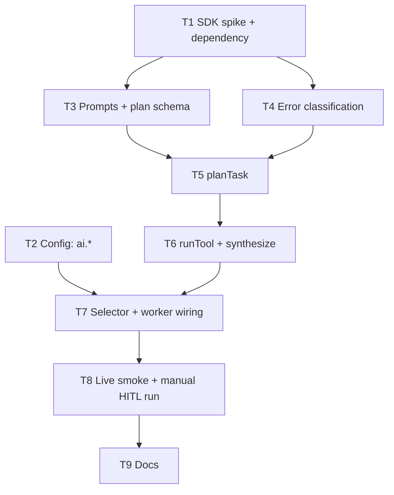

# Implementation Plan: Claude-backed `AiToolsActivities`

> Implements `docs/SPEC.md`. Status: **DRAFT — awaiting review (Phase 2: Plan).**
> Task list with phases and checkboxes: `docs/TASKS.md`.

## Overview

Add `createClaudeAiTools` — a second implementation of the `AiToolsActivities` port using
`@anthropic-ai/sdk` — plus config (`AI_PROVIDER`, `ANTHROPIC_API_KEY`, `ANTHROPIC_MODEL`) and
selection in `activities/index.ts`. The workflow, port, types, HTTP API and CLI are untouched.
Default stays `mock`, so every existing test and the offline demo keep working.

## Dependency graph

T2 is independent of T1/T3/T4 and can run in parallel with them; everything else is sequential.

## Architecture decisions

- **Client is injected, not imported in the adapter.** `createClaudeAiTools(logger, client, { model })` takes `Pick<Anthropic, 'messages'>`, so unit tests pass a fake. The real `new Anthropic({ apiKey, maxRetries: 0 })` is built only in the selector's `claude` branch — the mock path never constructs it.
- **Temporal owns retries** (`maxRetries: 0`). Classification lives in one pure helper (`claude-errors.ts`) so the table in the spec is unit-testable in isolation.
- **Prompts are pure functions** in `claude-prompts.ts` (topic/feedback/guidance in → messages out), separately testable from the SDK call. User text goes in the user turn inside delimited tags, never in `system`.
- **Plan validation at the adapter edge** with Zod: 1–8 steps, `tool ∈ ToolName`, non-empty descriptions; ids assigned by code. Reuse the `ToolName` union from `workflow/types.ts` (a const tuple duplicated in the schema must be `satisfies`-checked against it so they can't drift).
- **Fail-fast config:** the key requirement is a Zod `superRefine` on `AppConfig` (provider `claude` ⇒ key present), so the error surfaces in `loadConfig()` before the worker connects to Temporal.
- **No behavioral workflow change.** The activity timeout stays 1 minute; it is now a shared constant in `workflow/activity-timeout.ts` (`ACTIVITY_START_TO_CLOSE_MS`) from which the Claude client timeout is derived.
- **Vertical slicing:** T5 delivers a working `planTask` end-to-end (prompt → call → validate → error mapping) before `runTool`/`synthesize` reuse the same pattern in T6.

## Risks and mitigations

| Risk                                                                                                          | Impact | Mitigation                                                                                                                                                                         |
| ------------------------------------------------------------------------------------------------------------- | ------ | ---------------------------------------------------------------------------------------------------------------------------------------------------------------------------------- |
| SDK structured-output API/shape differs from my assumption (`output_config.format`, Zod helper, Zod 4 compat) | High   | **T1 spike first**: install, read installed types/docs (context7), write findings into this plan before any adapter code. Fallback: hand-written JSON schema + `JSON.parse` + Zod. |
| `claude-sonnet-5` rejects a param (sampling, thinking, effort placement) → 400 at runtime                     | Med    | T1 records exact accepted params; T8 live smoke catches any remainder. Unit tests assert the request has no `temperature`/`top_p`/`budget_tokens`.                                 |
| Activity exceeds the 1-minute `startToCloseTimeout`                                                           | Med    | Small `max_tokens`, thinking off; measure in T8; the client timeout (limit − 15 s) turns a hung call into a retryable error.                                                       |
| API key leaks via logs/errors/`.env`                                                                          | High   | Key only in `AppConfig.ai.apiKey`; never log config or SDK request options; test asserts key absent from thrown/logged values; `.env.local` already git-ignored.                   |
| Prompt injection via topic/feedback/guidance                                                                  | Med    | Delimited-data prompt design; output is schema-validated and only ever rendered as text; no tool execution from model output.                                                      |
| Model returns plan with bad tool names / 0 or 30 steps                                                        | Med    | Zod bounds → non-retryable failure (retrying an identical prompt rarely fixes it; workflow surfaces the error).                                                                    |
| Cost surprises during demo                                                                                    | Low    | Small per-activity `max_tokens`; default provider `mock`; live test opt-in.                                                                                                        |
| `noUncheckedIndexedAccess` / `verbatimModuleSyntax` friction with SDK types                                   | Low    | Use `import type Anthropic`; narrow content blocks by `.type`.                                                                                                                     |

## Verification checkpoints

- **After T4 (foundations):** build/lint/format clean; new pure modules fully unit-tested; no adapter yet.
- **After T7 (wired, offline):** `npm test` all green (existing 22 + new); default provider path proven unchanged; `AI_PROVIDER=claude` w/o key fails fast.
- **After T8 (live):** real HITL run recorded (workflow id, plan, final answer excerpt) — evidence for Success Criterion 3.
- **After T9 (done):** all 8 spec success criteria checked off.

## Process constraints (from project memory)

- Work on a **feature branch** (e.g. `feat/claude-ai-tools`), never master; verify the branch before every commit.
- **No commit/push without explicit approval**; Conventional Commits (commitlint); husky pre-commit runs `format:check` + `lint` + `build`.
- **Do not start the next phase/task batch without confirmation** at each checkpoint.

## Open questions

Spec open questions resolved by their stated defaults (thinking off; timeout unchanged unless
T8 demands; hard-coded per-activity token limits; no prompt caching). Say so if any should change.

## SDK findings (T1) — `@anthropic-ai/sdk` 0.128.0

Verified against the installed types in `node_modules/@anthropic-ai/sdk` (not from memory).

- **Install:** pinned exactly (`0.128.0`) — `.npmrc` has `save-exact=true`, the repo policy for new deps.
- **Structured output:** `output_config: { format: { type: 'json_schema', schema } }`. `zodOutputFormat(zodSchema)` from `@anthropic-ai/sdk/helpers/zod` builds it and imports `zod/v4`, compatible with our Zod 4. `messages.parse()` exists (returns `parsed_output | null`).
- **Decision — `create` + own validation, not `parse`:** the helper's schema is _lossy_: `enum` becomes a plain `string` with a `{enum: [...]}` description hint and `maxItems` is folded into a description (only `minItems`/`required`/`additionalProperties: false` are real constraints). So `PlanOutputSchema.safeParse(JSON.parse(text))` in the adapter is what actually enforces tool names and the 1–8 bound. Bonus: the injected client only needs `messages.create`.
- **Client:** `new Anthropic({ apiKey, maxRetries: 0 })` (default is 2; timeout default 10 min, ms). `Model` type includes `'claude-sonnet-5'`.
- **Errors** (`Anthropic.*`, all extend `APIError` with `.status`): retryable → `RateLimitError` (429), `InternalServerError` (any 5xx incl. 529 overloaded), `APIConnectionError`, `APIConnectionTimeoutError`; non-retryable → `BadRequestError` (400), `AuthenticationError` (401), `PermissionDeniedError` (403), `NotFoundError` (404), `UnprocessableEntityError` (422). `ConflictError` (409) is transient upstream — treat as retryable. Unknown errors: rethrow (Temporal retries, max 3).
- **`stop_reason`:** `end_turn | max_tokens | stop_sequence | tool_use | pause_turn | refusal | model_context_window_exceeded`. Only `end_turn` (and `stop_sequence`) is usable; every other value → non-retryable failure. `refusal` carries `stop_details.category` (`cyber|bio|frontier_llm|reasoning_extraction|general_harms|null`) — log the category, never the prompt.
- **`claude-sonnet-5` request params** (types show `temperature`/`thinking` exist, but per the Claude API reference the model rejects some): send **no** `temperature`/`top_p`/`budget_tokens`/prefill; **omitting `thinking` runs adaptive on this model**, so to keep thinking off the request sets `thinking: { type: 'disabled' }` explicitly (accepted on Sonnet 5); `output_config.effort` is one of `low|medium|high|xhigh|max`. These two points come from the API reference, not the types — **confirm in the T8 live smoke test.**
- **Cross-check (context7, `/anthropics/anthropic-sdk-typescript`):** confirms `zodOutputFormat` usage with `claude-sonnet-5`, the status→error-class mapping (`APIError.generate`), `maxRetries` default 2 / `timeout` in ms, and the `ThinkingConfigParam` / `OutputConfig.effort` types. It does not cover Sonnet 5's behaviour when `thinking` is omitted — still to confirm in T8.
- **Timeout (added after review):** the SDK default request timeout is 10 minutes, and Temporal does not abort an in-flight request when the activity's `startToCloseTimeout` fires. An attempt is limited to **1 minute** (`ACTIVITY_START_TO_CLOSE_MS`, unchanged; a 5-minute limit was tried and reverted), and `createClaudeClient` sets `timeout` to that minus 15 s (45 s), so a hung call ends as a retryable `APIConnectionTimeoutError` before the attempt times out. T8's measurements will show whether 45 s is enough for a 4096-token synthesis; if not, raise the limit deliberately (workflow change) rather than the client alone.
