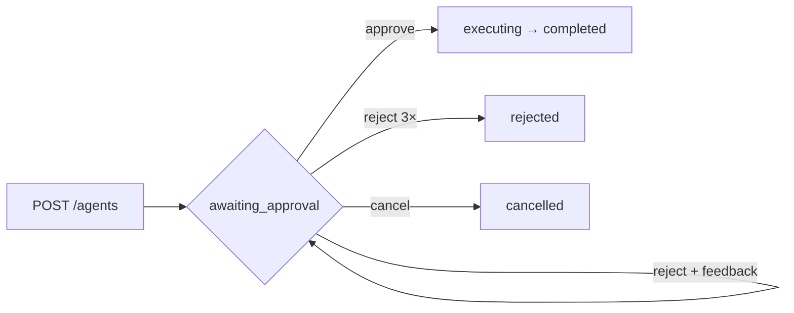

# Playbook — run, play, and test

Hands-on steps for driving the human-in-the-loop agent and running the test suite. See
[`README.md`](../README.md) for the overview and [`CLAUDE.md`](../CLAUDE.md) for the contract.



## 1. Start the stack

**Docker (one command):**

```bash
docker compose up            # temporal (+ Web UI) + worker + api
```

**Bare metal (three terminals):**

```bash
temporal server start-dev    # 1. cluster + Web UI (:7233 / :8233)
npm run worker               # 2. worker — hosts workflow + activities
npm run api                  # 3. Fastify REST API on :3000
```

Open the **Web UI at <http://localhost:8233>** and keep it visible — you'll watch workflows
and their event history there. REST API is at <http://localhost:3000>.

### Shell helpers (optional)

Paste these so the scenarios can reuse the workflow id:

```bash
start() { curl -s -X POST localhost:3000/agents -H 'content-type: application/json' \
  -d "{\"topic\":\"$1\"}" | node -pe 'JSON.parse(require("fs").readFileSync(0)).data.workflowId'; }
state() { curl -s localhost:3000/agents/$1 \
  | node -pe 'JSON.stringify(JSON.parse(require("fs").readFileSync(0)).data,null,2)'; }
approve() { curl -s -X POST localhost:3000/agents/$1/approve -H 'content-type: application/json' -d "{\"approved\":$2}"; }
```

## 2. Scenarios to play

### Happy path — approve

```bash
ID=$(start "temporal vs cron"); echo "$ID"
state "$ID"                 # awaiting_approval, revision 1, a 3-step plan
approve "$ID" true
state "$ID"                 # executing → completed, with finalAnswer
```

### Reject with feedback → re-plan

```bash
ID=$(start "durable execution")
curl -s -X POST localhost:3000/agents/$ID/approve -H 'content-type: application/json' \
     -d '{"approved":false,"feedback":"go deeper on retries"}'
state "$ID"                 # revision → 2; step 1 echoes the feedback
approve "$ID" true
state "$ID"                 # completed
```

### Reject 3× → rejected (the guardrail)

```bash
ID=$(start "endless debate")
for i in 1 2 3; do approve "$ID" false; sleep 1; done
state "$ID"                 # status: rejected (MAX_REJECTIONS)
```

### Cancel while awaiting approval

```bash
ID=$(start "never approve me")
curl -s -X POST localhost:3000/agents/$ID/cancel
state "$ID"                 # status: cancelled
```

### Guidance affects execution

```bash
ID=$(start "compare message queues")
curl -s -X POST localhost:3000/agents/$ID/guidance -H 'content-type: application/json' \
     -d '{"guidance":"prefer recent sources"}'
approve "$ID" true
state "$ID"                 # step outputs include "(guidance: prefer recent sources)"
```

### Same workflow, three clients

- **CLI client:** `npm run start -- "my topic"` — starts a run and prints how to approve it.
- **Temporal CLI:**
  ```bash
  temporal workflow query  -w "$ID" --type getState
  temporal workflow signal -w "$ID" --name approvePlan --input '{"approved":true}'
  ```
- **Web UI:** open the workflow at <http://localhost:8233>, run the `getState` query and send
  the `approvePlan` signal from the UI, and inspect the full event history.

## 3. Things to observe

- **Log levels:** default `info` shows milestones. For every step + activity, use
  `LOG_LEVEL=debug` (bare metal: `LOG_LEVEL=debug npm run worker`).
- **HTTP access log:** each request logs one line with `responseTimeMs`, `rssMB`/`heapUsedMB`,
  and a `reqId`. Pass your own to trace a call: add `-H 'x-request-id: trace-42'`, then grep
  the api logs for `trace-42` (it also tags the handler's own log lines).
- **Durability:** start a run, leave it `awaiting_approval`, restart the worker
  (`Ctrl-C` → `npm run worker`), then approve — it resumes and completes (state lived in
  Temporal, not the worker).
- **Error envelopes:** `curl -s localhost:3000/agents/nope` → `404 { "error": { "code": "NOT_FOUND" } }`;
  `curl -s -X POST localhost:3000/agents -H 'content-type: application/json' -d '{}'` → `400 VALIDATION_ERROR`.

## 4. Run the tests

No dev server or worker needed — the tests boot their own in-process Temporal test server.

```bash
npm test            # everything: unit + endpoint e2e (22 tests)
npm run test:unit   # colocated unit/component tests (activities, config, workflow state machine)
npm run test:feature # endpoint e2e in features/ (real Fastify → client → worker → activities)
npm run build       # strict typecheck (tsc --noEmit)
npm run lint        # ESLint
npm run format:check # Prettier
```

What the tiers cover:

- **Unit** — mocked-AI functions, config parsing/validation, and the workflow state machine
  (`TestWorkflowEnvironment` + mocked activities: approve, reject→re-plan, reject-limit, cancel).
- **Endpoint e2e** — the real HTTP surface end to end: `POST /agents` → poll → approve →
  `completed`, plus `400` / `404` / `/healthz`.

## 5. Tear down

```bash
docker compose --profile tools down -v     # Docker
# bare metal: Ctrl-C each terminal
```
