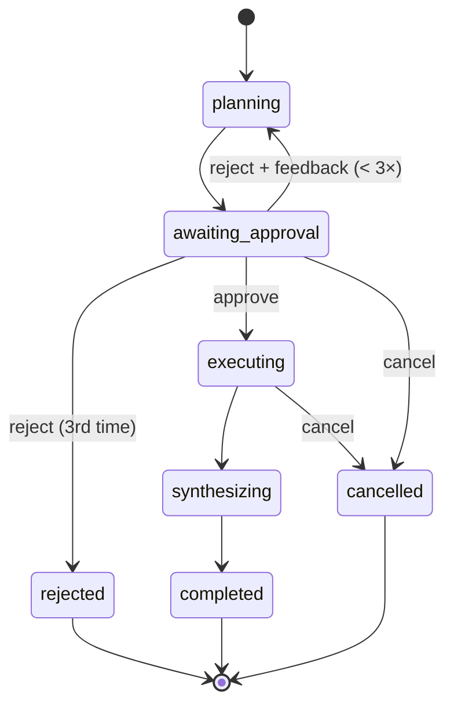

# Specification — Temporal AI-Agent workflow

> The behavioral contract the implementation must satisfy. Detailed enough to build and
> test against. Companion to [`PLAN.md`](./PLAN.md).

## 1. Overview

`agentWorkflow` orchestrates a mocked "AI agent" that completes a research-style task in
four phases, pausing for a human between planning and execution:



All reasoning is **mocked** and lives in the activity implementation
(`activities/mock-ai-tools.ts`) as pure, deterministic functions — that's where a real LLM
call would go (I/O), so it's an adapter concern, not the workflow's model. The workflow
contains only orchestration. `workflow/types.ts` holds the model (types/interfaces); the
workflow's dependency contract is the `AiToolsActivities` port in `workflow/ports.ts`, and
`activities/index.ts` is the Strategy seam that selects a concrete implementation.

## 2. Domain model (`src/workflow/types.ts`)

```ts
export type ToolName = 'search' | 'summarize' | 'draft';

export interface PlanStep {
  id: number; // 1-based, stable within a plan
  description: string;
  tool: ToolName;
}

export interface Plan {
  topic: string;
  steps: PlanStep[]; // non-empty
}

export interface StepResult {
  stepId: number;
  output: string;
}

export type AgentStatus =
  | 'planning'
  | 'awaiting_approval'
  | 'executing'
  | 'synthesizing'
  | 'completed'
  | 'rejected' // terminal: too many rejections (see §6)
  | 'cancelled'; // terminal: cancel signal received

export interface AgentState {
  status: AgentStatus;
  topic: string;
  revision: number; // increments each (re)plan; starts at 1
  plan?: Plan; // set once planned
  currentStepId?: number; // set during 'executing'
  results: StepResult[];
  guidance: string[]; // accumulated mid-run guidance
  finalAnswer?: string; // set on 'completed'
}
```

The behavior (the mocked "AI") is NOT here — it lives in the activity implementation
(`activities/mock-ai-tools.ts`, §5) as pure, deterministic functions:

```ts
planTask(topic: string, feedback?: string): Promise<Plan>
runTool(step: PlanStep, guidance: readonly string[]): Promise<StepResult>
synthesize(topic: string, results: readonly StepResult[]): Promise<string>
```

Being pure, they are unit-testable with zero Temporal machinery
(`activities/mock-ai-tools.test.ts`).

## 3. Workflow I/O (`src/workflow/agent.workflow.ts`)

```ts
export interface AgentInput {
  topic: string;
}

export interface AgentResult {
  status: 'completed' | 'rejected' | 'cancelled';
  finalAnswer?: string; // present iff status === 'completed'
  revision: number;
  stepCount: number;
}

export async function agentWorkflow(input: AgentInput): Promise<AgentResult>;
```

## 4. Contracts (`src/workflow/contracts.ts`)

All signal/query definitions and payload schemas (agent input/result, approve-plan,
provide-guidance, cancel, get-state) in one file. Shared by the workflow and any client (the
CLI, the HTTP API). The task queue is **config** (`config.temporal.taskQueue`, env
`TEMPORAL_TASK_QUEUE`), not a contract.

```ts
// Signals
export const approvePlan = defineSignal<[ApprovePlanInput]>('approvePlan');
export const provideGuidance = defineSignal<[string]>('provideGuidance');
export const cancelAgent = defineSignal<[]>('cancel');

// Query
export const getState = defineQuery<AgentState>('getState');

export interface ApprovePlanInput {
  approved: boolean;
  feedback?: string; // used when approved === false to steer re-planning
}
```

### Signal semantics

| Signal            | Payload                   | Effect                                                                                                                                                                 |
| ----------------- | ------------------------- | ---------------------------------------------------------------------------------------------------------------------------------------------------------------------- |
| `approvePlan`     | `{ approved, feedback? }` | `approved: true` → proceed to execute. `approved: false` → re-plan with `feedback` (revision++), stay awaiting approval. Ignored unless status is `awaiting_approval`. |
| `provideGuidance` | `string`                  | Append to `guidance`; applied to subsequent `runTool` calls. Accepted anytime before completion.                                                                       |
| `cancel`          | —                         | Request graceful stop; workflow ends `cancelled` at the next safe point.                                                                                               |

### Query semantics

| Query      | Returns               | Rule                                                    |
| ---------- | --------------------- | ------------------------------------------------------- |
| `getState` | `AgentState` snapshot | **Read-only.** Must not mutate state or run activities. |

## 5. Activity port & adapter

**Port** (`src/workflow/ports.ts`) — the dependency the workflow declares, and the Strategy
interface the `activities/` implementations are selected behind:

```ts
export interface AiToolsActivities {
  planTask(topic: string, feedback?: string): Promise<Plan>;
  runTool(step: PlanStep, guidance: string[]): Promise<StepResult>;
  synthesize(topic: string, results: StepResult[]): Promise<string>;
}
```

**Implementation** (`src/activities/mock-ai-tools.ts`) implements the port with the mocked,
deterministic `planTask`/`runTool`/`synthesize` — the single place the fake "AI" lives, and
where a real LLM call would go (e.g. a Claude-backed sibling implementation). Typed
`satisfies AiToolsActivities` so the port and impl can't drift. `src/activities/index.ts` is
the Strategy selection point `worker.ts` calls — today it only has the mock to choose from.

**Proxy options** (in the workflow):

```ts
const acts = proxyActivities<AiToolsActivities>({
  startToCloseTimeout: '1 minute',
  retry: { initialInterval: '1s', maximumAttempts: 3 },
});
```

## 6. Workflow state machine

Initial: `{ status: 'planning', topic, revision: 1, results: [], guidance: [] }`.

1. **planning** → `plan = await planTask(topic)` → set `plan`, `status = 'awaiting_approval'`.
2. **awaiting_approval** → `await condition(() => approvalDecision !== undefined || cancelled)`.
   - `cancel` → `status = 'cancelled'` → return.
   - `approvePlan(false, feedback)` → `status = 'planning'`, `revision++`,
     `plan = await planTask(topic, feedback)` → back to `awaiting_approval`.
     After **MAX_REJECTIONS = 3** rejections → `status = 'rejected'` → return.
   - `approvePlan(true)` → `status = 'executing'`.
3. **executing** → for each `step` of `plan.steps` (in order):
   - if `cancelled` → `status = 'cancelled'` → return.
   - `currentStepId = step.id`; `result = await runTool(step, guidance)`; push to `results`.
4. **synthesizing** → `finalAnswer = await synthesize(topic, results)`.
5. **completed** → `status = 'completed'` → return
   `{ status, finalAnswer, revision, stepCount: results.length }`.

Terminal states: `completed`, `rejected`, `cancelled`.

## 6a. Configuration contract (`src/infra/config`)

The **only** module that reads `process.env`. Loads `.env` then `.env.local` (local
overrides base), then zod-validates into a typed, frozen `AppConfig`. Everything else
depends on `AppConfig`, never on `process.env` (DIP + DRY).

```ts
// schema is the single source of truth; the type is inferred from it. Grouped by concern.
export const AppConfigSchema = z.object({
  nodeEnv: z.enum(['development', 'test', 'production']).default('development'),
  logLevel: z.enum(['debug', 'info', 'warn', 'error']).default('info'),
  http: z.object({
    port: z.coerce.number().int().positive().default(3000),
    host: z.string().min(1).default('0.0.0.0'),
  }),
  corsOrigin: z.string().min(1).default('*'),
  temporal: z.object({
    connection: z.object({
      address: z.string().min(1).default('localhost:7233'),
      namespace: z.string().min(1).default('default'),
      apiKey: z.string().min(1).optional(), // set via .env.local for Cloud
    }),
    taskQueue: z.string().min(1).default('ai-agent'),
  }),
});
export type AppConfig = z.infer<typeof AppConfigSchema>;

export const loadConfig = (env?: Record<string, string | undefined>): AppConfig; // throws on invalid env
```

**Env var mapping / precedence:** `NODE_ENV`, `TEMPORAL_ADDRESS`, `TEMPORAL_NAMESPACE`,
`TEMPORAL_API_KEY`, `TEMPORAL_TASK_QUEUE`, `HTTP_PORT`, `HTTP_HOST`, `CORS_ORIGIN`,
`LOG_LEVEL` (flat env vars map to the grouped `AppConfig` above). Precedence highest→lowest:
real `process.env` → `.env.local` → `.env` → schema defaults. Runs with no env files
present. Loading uses Node's native `util.parseEnv` (no dotenv).

## 6a-bis. Logging contract (`src/infra/logger.ts`)

**pino** is the logging seam — `loggerOptions(config)` derives options from `AppConfig`
(shared so every process logs identically); level from `logLevel`.

- **Worker** builds a pino logger via `createLogger(config)`.
- **Activities** receive the logger **by injection** — `createAiToolsActivities(logger)` —
  rather than `@temporalio/activity`'s `log` (which throws outside an activity context), so
  they log in production yet stay directly unit-testable. Logs include business context
  (topic, stepId/tool).
- **API** — Fastify is built with `loggerOptions(config)`. One access-log line per request
  (`onResponse` hook: method/url/statusCode, `responseTimeMs` = total execution time, and a
  memory snapshot `rssMB`/`heapUsedMB`; Fastify's default two-line logging is disabled). `reqId` comes from an inbound `x-request-id` header when present (else a uuid)
  and tags both the access line and the handler's own `request.log` lines. Secrets are redacted
  via pino `redact` (`authorization`, `cookie`, `apiKey`, `temporalApiKey`).
- **Workflow** (`AgentRun`) must NOT use pino or any direct I/O — it logs phase transitions
  via `import { log } from '@temporalio/workflow'` (message-first API, routed through sinks).
  This preserves determinism (§7).
- **Levels:** `info` for business milestones (run started/awaiting/approved/finished, handler
  actions); `debug` for verbose per-step/per-activity detail (each `planTask`/`runTool`/
  `synthesize`, "Executing step") — hidden at the default `info`, shown with `LOG_LEVEL=debug`.
- `pino-pretty` is a dev-only transport for readable local output; JSON in production.

## 6b. Contracts & layer boundaries (strict)

Contracts are explicit at every seam; the workflow depends only on the port, never on an
adapter (`http`/`cli`/`activities`/`infra` → `workflow`).

| Seam            | Contract (owner)                                           | Consumers                           | Strictness                                        |
| --------------- | ---------------------------------------------------------- | ----------------------------------- | ------------------------------------------------- |
| Config          | `AppConfig` + `AppConfigSchema` (`infra/config`)           | worker, client, connection          | zod at load (runtime)                             |
| Domain model    | types in `workflow/types.ts`                               | all layers                          | TS types + `strictest`                            |
| Activity port   | `AiToolsActivities` (`workflow/ports.ts`)                  | workflow (proxy), activities (impl) | TS interface; impl must `satisfies` it            |
| Workflow API    | `AgentInput`, `AgentResult` (`workflow/agent.workflow.ts`) | CLI, HTTP API, tests                | zod-validate `AgentInput` at workflow entry       |
| Signals/queries | defs + payload types (`workflow/contracts.ts`)             | workflow, CLI, HTTP API, UI         | zod-validate payloads in handlers (external JSON) |
| HTTP API        | REST endpoints (`http/`) — see §6d                         | external HTTP callers               | zod-validate request body/params; helmet + cors   |

**Rules:**

- `workflow` must **not** import `infra`/`activities`/`http`/`cli` (it proxies the _port_,
  not an implementation).
- `workflow/contracts.ts` is the **single source** of signal/query names and payload types
  (DRY) — the client and the ops runbook reference it, never re-declare names.
- Each `activities/` implementation is typed `satisfies AiToolsActivities` so the port and
  impl can't drift.
- External JSON (signal payloads, `AgentInput`) is **parsed with zod at the boundary**;
  once past the boundary, code trusts the inferred types.

## 6c. Principles → concrete rules

Not slogans — each maps to something checkable in review:

- **SRP (S):** one reason to change per module — `workflow` = orchestration + model,
  `activities` = tool implementations, `infra` = cross-cutting plumbing (config/logger/
  connection), `http`/`cli` = process entrypoints. No mixing.
- **OCP (O):** new "tools" are added by extending `ToolName` + a branch in the active
  activities implementation, without editing the workflow's control flow.
- **LSP / ISP (L/I):** `AiToolsActivities` is the minimal port the workflow needs — no
  extra methods; any implementation satisfying it is substitutable (real vs mocked), which
  is exactly the Strategy pattern `activities/index.ts` selects between.
- **DIP (D):** high-level policy (workflow) depends on the port abstraction; the concrete
  implementation and config are injected at the edges (worker registration, `loadConfig`).
- **DRY:** one config reader, one contracts module, types inferred from zod schemas (no
  duplicated shape definitions).
- **KISS:** single package, single task queue, in-memory only; **no** child workflows,
  continue-as-new, DB, or abstraction we don't currently use.

## 6d. HTTP API contract (`src/http`)

A **Fastify** app that is a Temporal **Client** (not a worker — it hosts no workflow code).
It maps REST calls onto the same signals/queries in `workflow/contracts.ts`. Thin adapter:
no business logic, no state; every handler just validates input and calls the Temporal Client.

**Cross-cutting:** `@fastify/helmet` (security headers) + `@fastify/cors` (origin from
`AppConfig.corsOrigin`) registered globally; request/response logging via Fastify's pino.

**Response envelope** (consistent): success → `{ data: <payload> }`; error →
`{ error: { code, message, details? } }` with the matching HTTP status.

| Method & path               | Body / params                              | Temporal action                     | Success                          | Errors               |
| --------------------------- | ------------------------------------------ | ----------------------------------- | -------------------------------- | -------------------- |
| `POST /agents`              | `{ topic: string (1..) }`                  | `client.start(agentWorkflow, …)`    | `201 { data: { workflowId } }`   | `400` invalid body   |
| `GET /agents/:id`           | `id` param                                 | `handle.query(getState)`            | `200 { data: AgentState }`       | `404` unknown id     |
| `POST /agents/:id/approve`  | `{ approved: boolean, feedback?: string }` | `handle.signal(approvePlan, …)`     | `202` (accepted)                 | `400` invalid, `404` |
| `POST /agents/:id/guidance` | `{ guidance: string (1..) }`               | `handle.signal(provideGuidance, …)` | `202`                            | `400`, `404`         |
| `POST /agents/:id/cancel`   | —                                          | `handle.signal(cancelAgent)`        | `202`                            | `404`                |
| `GET /healthz`              | —                                          | — (liveness)                        | `200 { data: { status: 'ok' } }` | —                    |

**Rules:**

- Signals are fire-and-forget → `202 Accepted` (a signal cannot report workflow outcome).
- Request schemas live in `http/schemas.ts` and **reuse** the payload schemas from
  `workflow/contracts.ts` where they overlap (e.g. `ApprovePlanInput`) — DRY, no re-declaring.
- Map Temporal errors to HTTP: workflow-not-found → `404`; validation → `400`; else `500`
  with a generic message (no internal details leaked — see §7).
- The API depends only on `workflow/contracts.ts` + `infra` (Client, config, logger); it
  must not import `workflow` internals or the `activities` implementations.

## 7. Determinism & correctness constraints

- **No** `Date.now()` / `Math.random()` / I/O in workflow code — all non-determinism lives
  in activities. (The SDK sandbox patches the first two, but we still avoid relying on them.)
- Iterate `plan.steps` in stable order; step ids are stable within a revision.
- Signal handlers are **non-async** (they only mutate local state); no activities/sleeps in
  handlers or in the query handler or update validators.
- Under `@tsconfig/strictest`, `noUncheckedIndexedAccess` makes indexed access `T |
undefined` — guard array/index reads explicitly.
- All `@temporalio/*` packages must share one identical version.
- Zod validation is **synchronous** — safe inside signal/query handlers (no async, no
  activities). Invalid signal payloads are validated then rejected/ignored with a logged
  reason (a signal cannot fail the sender); malformed `AgentInput` throws at workflow entry.

## 8. Run & interaction model

- Cluster (`temporal`) → Worker (`worker`, hosts workflow+activities) → Client (starts).
- After `start`, the workflow **blocks** at `awaiting_approval`. A human then:
  - inspects the plan: `getState` query (Web UI or `temporal workflow query`), and
  - approves/rejects: `approvePlan` signal (Web UI or `temporal workflow signal`).
- The client process may exit immediately after starting; the workflow persists in the
  cluster and continues on the worker regardless.

## 9. Acceptance criteria

- [ ] **Happy path:** start → approve → workflow completes with a non-empty `finalAnswer`
      derived from all step results; `stepCount === plan.steps.length`.
- [ ] **Reject → re-plan:** `approvePlan(false, feedback)` produces a new plan, increments
      `revision`, and remains awaiting approval; feedback reaches `planTask`.
- [ ] **Reject limit:** after `MAX_REJECTIONS` rejections the workflow ends `rejected`.
- [ ] **Cancel while waiting:** `cancel` before approval ends the workflow `cancelled`.
- [ ] **Cancel during execution:** `cancel` mid-execution ends `cancelled` without running
      remaining steps.
- [ ] **Query:** `getState` returns an accurate snapshot at each phase and never mutates
      state.
- [ ] **Guidance:** `provideGuidance` before/at execution is reflected in `runTool` output.
- [ ] **Determinism:** workflow replays cleanly (no non-determinism errors) — verified by
      the Vitest time-skipping environment.
- [ ] **Config:** `loadConfig()` returns defaults with no env files; `.env.local` overrides
      `.env`; invalid `LOG_LEVEL` throws a clear error.
- [ ] **Boundary validation:** malformed `approvePlan` JSON is rejected (logged, state
      unchanged); malformed `AgentInput` throws at workflow entry.
- [ ] **Boundaries hold:** `workflow` does not import `infra`/`activities`/`http`/`cli`; the
      HTTP API imports no `workflow` internals beyond `contracts.ts`/`agent.workflow.ts`.
- [ ] **HTTP API:** `POST /agents` starts a run and returns `201 { data: { workflowId } }`;
      `GET /agents/:id` returns the state; `POST .../approve` returns `202` and drives the
      workflow to completion; invalid bodies → `400`; unknown id → `404`; `GET /healthz` →
      `200`. Responses carry helmet security headers.
- [ ] **Logging:** structured pino output at `LOG_LEVEL`; workflows log via SDK `log`, not
      pino.
- [ ] **Commits:** a non-conventional commit message is rejected by commitlint (commit-msg
      hook); pre-commit runs lint + build.
- [ ] **Quality gates:** `npm run build`, `npm run lint`, `npm run format:check`,
      `npm test` all pass.

## 10. Test plan (three tiers, Vitest)

### Smoke — manual (`curl`, not automated)

A documented checklist against a live stack (`temporal server start-dev` + `npm run worker`

- `npm run api`): `POST /agents` → `GET /agents/:id` → `POST /agents/:id/approve` → confirm
  `completed`. Lives in the `temporal-agent-ops` skill / README.

### Unit — colocated (`*.test.ts` beside the source), collaborators mocked

- `src/activities/mock-ai-tools.test.ts` — the mocked `planTask` / `runTool` / `synthesize`
  implementation, incl. edge cases.
- `src/infra/config/config.test.ts` — defaults with no env files; `.env.local` overrides
  `.env`; invalid `LOG_LEVEL` throws.
- `src/workflow/agent.workflow.test.ts` — `TestWorkflowEnvironment.createTimeSkipping()`
  with **mocked activities** (the workflow's decision logic in isolation):
  - Happy path — start, assert awaiting approval via `getState`, `approvePlan(true)`, await
    result, assert `completed` + final answer + step count.
  - Reject then approve — `approvePlan(false, 'more detail')`, assert revision bump &
    feedback passed to mocked `planTask`, then approve and complete.
  - Reject limit — reject `MAX_REJECTIONS` times → `rejected`.
  - Cancel while awaiting approval → `cancelled`.
  - Cancel during execution (mid-step, via a gated `runTool`) → `cancelled` without running
    remaining steps.
  - Malformed `approvePlan` payload → ignored; a later valid signal still completes normally
    at the same revision.
  - `approvePlan` received outside `awaiting_approval` (mid-execution, via a gated
    `runTool`) → ignored, no re-plan.
  - Blank `provideGuidance` payload → ignored (`state.guidance` stays empty).
- `src/http/error-handler.test.ts` — the generic 500 fallback (`ZodError`/
  `WorkflowNotFoundError` are exercised via the e2e test below): unexpected errors map to a
  `500 { error: { code: 'INTERNAL' } }` envelope with no internal details leaked.

The rest of the HTTP layer (`routes/agents.ts`) has **no separate unit route tests** — it's a
thin adapter with no branching logic of its own, so it's covered end to end by the feature
test below instead (real Fastify app, no mocked Client).

### Feature / e2e — `features/` (repo root), everything real

- `features/http-api.feature.test.ts` — **real Fastify app → real Temporal Client → real
  worker → real activities**, on a time-skipping test server: `POST /agents` → `GET
/agents/:id` → `POST /agents/:id/approve`, poll until `completed`; plus the `guidance` and
  `cancel` signals, `400` (bad body), `404` (unknown workflow), and `/healthz`. Validates the
  layers actually wire together (API → client → workflow → activities).
